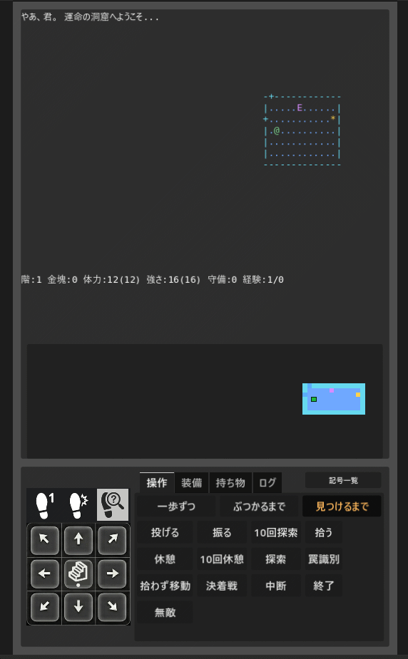

# Rogue Mobile (Godot)

English version: [README.en.md](README.en.md)

このプロジェクトは、Rogue2.Official（rougeclone2）をベースに、
スマートフォンの縦画面で遊びやすくすることを目的とした移植プロジェクトです。

## 概要

- ベース: Rogue2.Official（rougeclone2）
- 目的: 縦画面・タッチ操作を前提としたプレイ体験の実現
- 実装方針: 元のゲーム性を尊重しつつ、UI/操作系をモバイル向けに最適化

## 開発環境

- Godot: 4.6

## スクリーンショット

## 参照元

- Rogue2.Official: https://github.com/suzukiiichiro/Rogue2.Official
- 開発時の参照資料として利用しています（本リポジトリには同梱しません）。

## ライセンスと準拠方針

本プロジェクトは、参照元である rougeclone2 のライセンス条件に準拠して運用します。
具体的には、上流リポジトリの COPYING に記載されている利用条件に従い、
その条件に違反しない範囲で開発・公開しています。

ゲーム中に表示される文言の言語ファイルは、オリジナルのファイルを加工して利用しています。
このため、関連するライセンス条件の適用対象として扱います。

上流 COPYING の「使用許諾書（LICENSE）」には、
「データ分離版ローグ・クローンII」および
「ローグ・クローン2 日本語版1.3」に準拠する旨が記載されています。
本プロジェクトもこの準拠関係を継承します。

## このプロジェクトのソース利用条件

本プロジェクトのソース利用（利用・改変・再配布）は、
rougeclone2 の条件に準拠します。
特に以下の条件を満たしてください（上流 COPYING より）。

1. 利益を目的として販売しないこと
2. すべてのドキュメントを付属させること
3. 配布したソースまたは実行ファイルの利用・改変・再配布に、さらに制限を加えないこと

また、元ドキュメントにある著作権・著作人格権・オリジナル注釈の扱いについても、
上流 COPYING の記述を尊重してください。

サードパーティフォント（DejaVu Sans Mono / Noto Sans JP）については、
以下の同梱ライセンス文書を確認してください。

- docs/third_party_fonts/DejaVuSansMono-LICENSE.txt
- docs/third_party_fonts/NotoSansJP-OFL-1.1.txt
- docs/third_party_fonts/README.md

## 動作方針と不具合報告のお願い

- ゲーム動作は、UI部分を除いて原作と同等になるよう実装しています。
- 原作と異なる動作を見つけた場合は、Issue で報告してください。
- テストは継続中であり、十分とは言えません。不具合を見つけた場合も Issue で報告してください。

## デバッグ機能

- デバッグ用途として、無敵モードを搭載しています。

## 配布方針

- Android 版は GitHub Releases で配布します（APK はリポジトリ本体には含めません）。
- iOS 版は公開コストがかかるため、当面は公開を予定していません。

## Android 版の要件（現行設定）

- 対応 ABI: arm64-v8a のみ
- 画面サイズ: small / normal / large / xlarge を有効
- `min_sdk` / `target_sdk`: `export_presets.cfg` では未指定（Godot 4.6 の Android エクスポートテンプレート既定値に依存）

注意:

- 既定の API レベルは Godot バージョンやテンプレート更新で変わる可能性があります。
- 公開時は、実際にビルドした APK のマニフェスト情報を確認して Release 本文に API レベルを明記してください。

## Release 公開時の同梱物

APK を公開する場合、少なくとも次の文書を同時に配布してください（同一 Release に添付）。

1. LICENSE
2. docs/third_party_fonts/README.md
3. docs/third_party_fonts/DejaVuSansMono-LICENSE.txt
4. docs/third_party_fonts/NotoSansJP-OFL-1.1.txt

推奨運用:

- `RogueMobile.apk` に加えて、上記ライセンス文書を含む `RogueMobile-licenses.zip` を同一 Release に添付する。
- Release 本文に upstream COPYING と本リポジトリ LICENSE への参照を明記する。

## 注意

- 本 README は、上流 COPYING の内容を参照しやすくまとめたものです。
- 法的な最終判断は、必ず上流 COPYING 原文および必要に応じて専門家確認を行ってください。
- 上流 COPYING: https://github.com/suzukiiichiro/Rogue2.Official/blob/master/COPYING
- ルートライセンス通知: LICENSE
